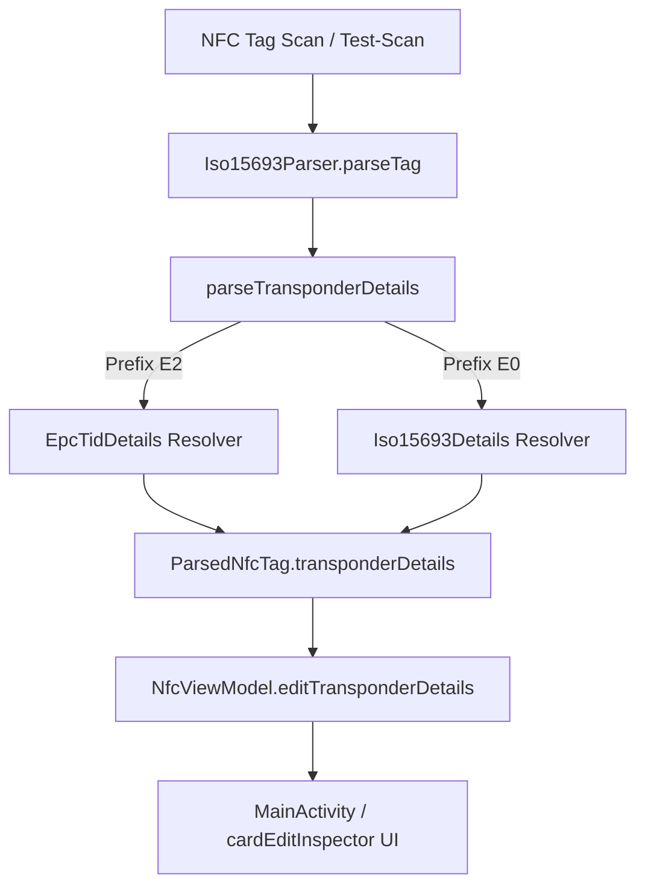

# Requirements

### Overview & Goals
Ziel ist es, die vollständig aufgelöste TID-Struktur (bei EPC Gen 2 / ISO 15963 Transpondern) sowie herstellerspezifische UID-Informationen (bei ISO 15693 HF-Transpondern) transparent in der App-Benutzeroberfläche unter **"Transponder-Informationen"** darzustellen. Hierzu gehören Chiphersteller (inkl. Mask Designer ID / MDID), Chipmodell (Tag Model Number / TMN), Steuer- und Headerflags (XTID, Security, FileOpen) sowie Seriennummer / XTID-Segment.

### Scope
- **In Scope:**
  - Erweiterung des Parsers (`Iso15693Parser.kt`) um strukturierte Datentypen (`EpcTidDetails`, `TransponderDetails`) zur vollständigen Extraktion von Header, MDID, TMN, Chiphersteller, Modellbezeichnung und Seriennummer.
  - Anbindung der aufgelösten Transponder- und TID-Details an `ParsedNfcTag` und `NfcViewModel`.
  - Erweiterung der Benutzeroberfläche in `activity_main.xml` und `MainActivity.kt` im Bereich **"Transponder-Informationen"** (Edit-/Inspektor-Modus und Scan-Details), um die aufgelösten Felder (Hersteller, Modell, Flags, Seriennummer) übersichtlich anzuzeigen.
  - Erweiterung der Test-Scan-Funktion (`triggerTestEditScan`), um auch EPC Gen 2 TIDs (z. B. UCODE 9, Monza R6) direkt testen zu können.
  - Umfassende Unit-Tests für die Extraktion und UI-Bereitstellung der aufgelösten TID- und Transponder-Struktur.
- **Out of Scope:**
  - Physische UHF-Funkverbindung (die App agiert über Android HF/NFC bzw. Dual-Frequenz-/ISO-15693-Transponder).

# Technical Design

### Current Implementation
- `Iso15693Parser.resolveIso15693TagType(uidHex)` ermittelt bereits eine zusammenfassende String-Bezeichnung für `E0...` (HF) und `E2...` (EPC Gen 2 / TDS 2.0).
- Im UI (`activity_main.xml` -> `cardEditInspector`) werden derzeit nur UID, zusammenfassender Transponder-Typ, AFI-Status und CRC-Status als einfache Strings angezeigt. Einzelheiten wie MDID-Bits, Chipmodell-Bezeichnung, Datenblatt-Links oder XTID-Flags werden noch nicht strukturiert im UI aufgeschlüsselt.

### Key Decisions
- **Strukturiertes Datenmodell:** Einführung von `EpcTidDetails` und `Iso15693Details` (gebündelt in `TransponderDetails` oder direkt in `ParsedNfcTag`), um alle Felder typsicher zu erfassen:
  - `allocationClass`: z. B. `0xE2`
  - `hasXtid`, `hasSecurity`, `hasFileOpen`: Booleans für Bits 23..21
  - `mdidInt`, `mdidHex`, `mdidBinary`: Mask Designer ID
  - `manufacturerName`, `manufacturerUrl`: Chiphersteller aus `mdid_list.json`
  - `tmnHex`, `modelName`, `productUrl`: Chipmodell & Datenblatt-URL
  - `serialNumberHex`: Seriennummer / verbleibende Bits (XTID)
- **UI-Präsentation:**
  - Im Inspektor-Bereich (`cardEditInspector`) wird ein dynamischer Detailbereich ergänzt, der bei `EPC_GEN2_TID` die Felder **Hersteller** (mit MDID), **Modell** (mit TMN), **Header & Flags** und **Seriennummer** anzeigt.
  - Bei ISO 15693 HF-UIDs werden analog **Hersteller** (mit IC-Code), **Produktcode** und **Seriennummer** angezeigt.
- **ViewModel-State:** `NfcViewModel` exponiert die strukturierten Details via `StateFlow` (`editTransponderDetails`), sodass `MainActivity` die Anzeige reaktiv aktualisiert.

### Data Models / Contracts
```kotlin
data class EpcTidDetails(
    val allocationClass: String = "E2",
    val hasXtid: Boolean,
    val hasSecurity: Boolean,
    val hasFileOpen: Boolean,
    val mdidInt: Int,
    val mdidHex: String,
    val mdidBinary: String,
    val manufacturerName: String,
    val manufacturerUrl: String? = null,
    val tmnHex: String,
    val modelName: String?,
    val productUrl: String? = null,
    val serialNumberHex: String? = null
)

data class Iso15693Details(
    val mfgCodeHex: String,
    val manufacturerName: String,
    val productCodeHex: String,
    val modelName: String?,
    val serialNumberHex: String
)

data class TransponderDetails(
    val identifierType: TagIdentifierType,
    val epcTid: EpcTidDetails? = null,
    val iso15693: Iso15693Details? = null,
    val formattedSummary: String
)
```

### Architecture Diagram


# Testing

### Validation Approach
Automatisierte Unit-Tests in `Iso15693ParserTest` und `NfcViewModelTest` überprüfen:
- Vollständige Dekodierung aller Felder eines EPC Gen 2 Short TIDs (`E2806995` -> NXP UCODE 9, Flags, MDID 6, TMN 995).
- Vollständige Dekodierung eines Extended TIDs (`E28069952000500101D589CC` -> inkl. Seriennummer `2000500101D589CC`).
- Vollständige Dekodierung verschiedener Hersteller (Impinj Monza R6 `E2801160`, Alien Higgs 4 `E2803414`, EM Microelectronic `E280B110`).
- Dekodierung von ISO 15693 HF UIDs (`E004015012345678`).
- Korrekte Weitergabe der Daten im `NfcViewModel` an die StateFlows.

# Delivery Steps

### ✓ Step 1: Strukturiertes Datenmodell und Parsing-Logik für TID/UID in Iso15693Parser implementieren
Erweiterung von `Iso15693Parser.kt` um die detaillierte Aufschlüsselung von EPC Gen 2 TID- und ISO 15693 UID-Strukturen.

- Definition von `EpcTidDetails`, `Iso15693Details` und `TransponderDetails`.
- Implementierung von `parseEpcTidDetails(cleanTid)` mit Bit-Extraktion für XTID/Security/FileOpen Flags, 9-Bit MDID, 12-Bit TMN, Hersteller-URL, Datenblatt-URL und Seriennummer.
- Implementierung von `parseIso15693Details(cleanUid)` für HF-Transponder.
- Einbindung von `transponderDetails` in `ParsedNfcTag`.

### ✓ Step 2: UI-Darstellung und ViewModel-Integration für Transponder-Informationen
Anbindung der strukturierten Transponder-Informationen an `NfcViewModel` und Erweiterung der Benutzeroberfläche in `activity_main.xml` und `MainActivity.kt`.

- Ergänzung von `editTransponderDetails` StateFlow in `NfcViewModel.kt` und Befüllung bei Tag-Discovery.
- Aktualisierung des UI-Bereichs `cardEditInspector` in `activity_main.xml` um strukturierte Felder (Hersteller, Modell, Flags, Seriennummer).
- Bindung der neuen UI-Felder in `MainActivity.kt` zur reaktiven Anzeige der aufgeschlüsselten TID-Daten.
- Aktualisierung von `triggerTestEditScan` zur Unterstützung von EPC Gen 2 Test-TIDs.

### ✓ Step 3: Unit-Tests für strukturierte TID- und UID-Auflösung
Ergänzung von automatisierten Tests zur Verifikation aller extrahierten Felder.

- Unit-Tests in `Iso15693ParserTest.kt` für diverse Short- und Extended-TID-Muster (NXP UCODE, Impinj Monza, Alien Higgs, EM Microelectronic).
- Unit-Tests in `NfcViewModelTest.kt` für den StateFlow-Lebenszyklus und die Aktualisierung der Transponder-Details.